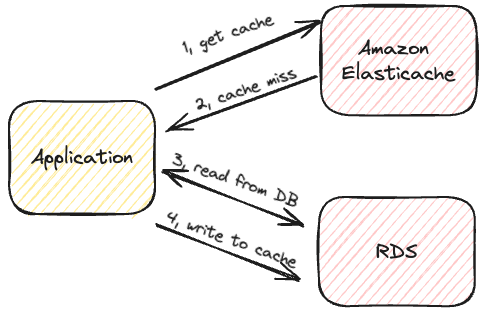
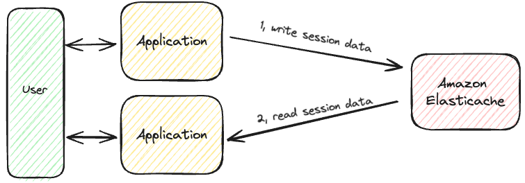
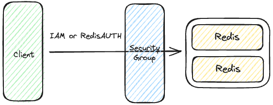

# Elasticache

## 概要

マネージドのRedis or Memcachedサービス

- RDSと同様の方法で構築可能
- インメモリデータベースサービス
- 非常に高いパフォーマンス
- 低遅延を実現
- 主に読み取り集中型のワークロードで使用する
  - 主な目的はデータベース負荷の軽減
- RDBに備わっているクエリキャッシュのようなイメージ
- 状態を保持させ、アプリケーション自体をステートレスに構築させる
- 自動で以下が行われる
  - OSメンテナンス
  - パッチ適用
  - 最適化
  - セットアップ
  - 環境設定
  - モニタリング
  - 障害回復
  - バックアップ
- アプリケーション側のコード修正は必須となる

### ベースとなるアプリケーション構成

#### DB負荷軽減を目的としたクエリキャッシュ

要件によるが、本構成の場合はDB側のキャッシュを無効化することができる。

#### セッションデータキャッシュ

ロードバランスされているアプリケーションに対して有用。
この場合はSticky Sessionを無効化できる。

### Redis or Memcached

- Redis
  - マルチAZ対応で自動フェイルオーバーさせることが可能
  - 読み取りをスケールさせたい場合はRead Replicaを構築可能
  - AOF永続性（ファイルへのデータ永続化）をサポート
  - バックアップ及びリストア可能
  - キャッシュ機能としてはSetsとSorted Setsをサポートしている
- Memcached
  - データのマルチノード格納（シャーディング）をサポート
  - 可用性は低い（レプリケーション不可）
  - 永続化はできない
  - バックアップ及びリストアはサポートしていない
  - マルチスレッド使用可能

### クラスターモード(Redis)

#### 有効

- 有効の場合は最大500までのシャードを保持可能

#### 無効

- 単一シャードのみ保持可能

### Cache Security

- Redisに対してのみIAM認証をサポート
  - その他はユーザー名とパスワードに対する認証となる
- IAMポリシーはAWS APIレベルのセキュリティのみに使用される
- Redis
  - Redis Cluster作成時にセットできる認証トークンを設定可能
  - Security Groupによる保護が可能
  - SSLによる通信暗号化
- Memcached
  - SASLベースの認証をサポート

### ClientからRedisへの接続

基本的には以下の2つとなる

- IAM認証
- 認証トークン（RedisAUTH）を用いた認証

