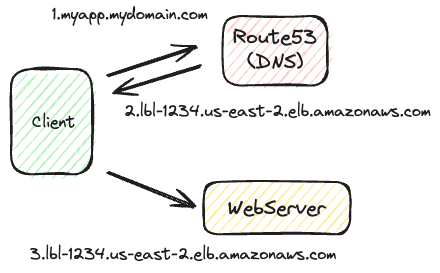
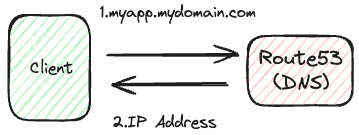
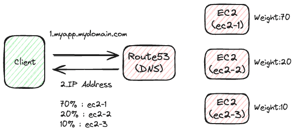
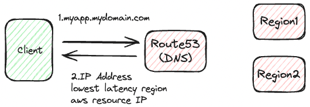

# Route53

## 概要

高可用性、スケーラブルなフルマネージドのDNS。

- DNSを完全に制御可能
- ドメインレジストラー
- Route53リソース内のヘルスチェックが可能
- AWS唯一の100%可用性のサービス

ちなみに53は従来のDNS用ポート番号。


## レコード

- 特定ドメインにおけるトラフィックのルーティン方法を定義
- 以下のような値を定義
  - ドメイン/サブドメイン名
  - レコードタイプ（Aレコード、AAAAレコードなど）
  - 値（IPアドレスなど）
  - ルーティングポリシー
    - クエリに応答する方法
  - TTL
    - DNSリゾルバーのキャッシュ生存時間
- レコードはDNSリゾルバーにキャッシュされる
- サポートするレコードは以下
  - Basic
    - A
    - AAAA
    - CNAME
    - NS
  - Advanced
    - CAA
    - DS
    - MX
    - NAPTR
    - PTR
    - SOA
    - TXT
    - SPF
    - SRV

## レコードタイプ

### Aレコード

ホスト名とIPv4アドレスをマッピングする。


ちなみにターミナルから以下のコマンドで確認できる。

```shell-session
nslookup [ドメイン]
```

```shell-session
dig [ドメイン]
```

AWSにおいては基本的には以下の用途で使用する。

- ドメインにアクセスした際に特定のAWSリソース（IPv4）に接続させる

### AAAAレコード

ホスト名とIPv6アドレスをマッピングする。

AWSにおいては基本的には以下の用途で使用する。

- ドメインにアクセスした際に特定のAWSリソース（IPv6）に接続させる

### CNAMEレコード

ホスト名を別のホスト名にマッピングする。  
他ドメインからAWSリソースへトラフィックするようにマッピングする。
非ドメインルートである必要がある。  
（「sample.com」ではなく、「aaa.sample.com」のような形式が必要）

- ターゲットとなるホスト名はAレコードやAAAAレコードとなる可能性がある。
- DNS名前空間、ZoneApex最上位ノードでは作成できない。
  - 例えば「example.com」のCNAMEレコードを作成することはできないが、「www.example.com」のCNAMEレコードは作成できる

AWSにおいては基本的には以下の用途で使用する。

- ドメインにアクセスした際に特定のAWSリソース（ドメイン）に接続させる
  - 「myapp.mydomain.com」にアクセスした時に「lbl-1234.us-east-2.elb.amazonaws.com」にアクセスさせたいとか



### Alias

Route53固有の機能。  
以下のような特徴がある。

- CNAMEと同様に特定のホスト名をAWSのリソース名に変換する
- CNAMEとの違い
  - ドメインルートでも動作する
    - （「aaa.sample.com」でも動作し、「sample.com」でも動作する）
  - ネイティブのヘルスチェック機能が含まれている
  - AWSのリソースのみにマッピング可能
- DNSの拡張
- 接続しているAWSリソースのIPが変更されたとしても自動で追跡してくれる
- AWS上ではAliasはAレコードまたはAAAAレコードとして登録する
- TTLを設定することができない（Alias先のTTLによって自動設定される）
  - Elastic Load Balancer（60秒）
  - Amazon CloudFront（60秒）
  - Elastic Beanstalk（60秒）
  - S3 Websites（3秒）
- 無料で利用可能

主に対象となるAWSリソースは以下の通り

- Elastic Load Balancer
- Amazon CloudFront
- Amazon API Gateway
- Elastic Beanstalk
- S3 Websites
- VPC Interface Endpoints
- Global Accelerator
- 同じホストゾーン内のRoute53レコード

EC2のDNSに対するAliasは設定できない点に注意する。

#### NSレコード

ホストゾーンのネームサーバ。

- ドメインにルーティングされる方法を制御可能

## ホストゾーン

レコードのコンテナとして機能し、ドメインにおけるトラフィックのルーティング方法を全て管理する。

### パブリックホストゾーン

パブリックなドメイン名（インターネット）のトラフィックのルーティング方法を全て管理する。

- 「xxxx.mypublicdomain.com」みたいなイメージ

### プライベートホストゾーン

プライベートなドメイン名（自身の仮想プライベートクラウド、VPC内）のトラフィックのルーティング方法を全て管理する。
企業内のみでアクセスできるネットワーク等で使用する。

- 「xxxx.mycompany.internal」みたいなイメージ

## 料金

ホストゾーンごとに支払う。

## TTL

「Time To Live」のこと。
クライアントは様々なエンドポイントにアクセスする際に基本的にはドメインでアクセスする。  
その場合、以下のようにアクセスが行われている。

1. クライアントはDNS（Route53）に一度アクセスを行い、ドメインのIPアドレスを取得する
2. クライアントは取得したIPアドレスに対してアクセスを行う

DNSからドメインのIPアドレスを取得する際にTTLも同時に取得する。  
TTLの時間分はクライアント側にIPアドレスのキャッシュが行われる。  
その期間内は同ドメインに対して再度アクセスした際にキャッシュしたIPアドレスに直接アクセスする。（DNSへの問い合わせは行わない）  

TTLがない、もしくはTTLの期限切れの場合  


TTLの期限内の場合  


Aliasレコードを除いて全てのレコードでTTLは必須となる。

### TTLを高めに設定した場合

TTLを高め（例えば24時間）に設定した場合はクライアントにキャッシュされる時間も長くなるため  
Route53に対するトラフィックは減少する（料金が下がる）  
ただし簡単にレコードの内容を更新することはできなくなる。

### TTLを低めに設定した場合

TTLを低め（例えば60秒）に設定した場合はクライアントにキャッシュされる時間も短くなるため  
Route53に対するトラフィックは増加する（料金が上がる）  
簡単にレコードの内容を更新することができる。

### ルーティングポリシー

- DNSクエリに対するRoute53の応答方法を定義する
  - ルーティングという名称だが、あくまでDNSクエリに対する応答であり、ロードバランサーのような機能を持つわけではないので混同しないこと
- 以下のポリシーをサポート
  - シンプルルーティング（Simple）
  - 加重（Weighted）
  - レイテンシー（Latency based）
  - フェイルオーバー（Failover）
  - 位置情報（Geolocation）
  - 複数値回答（Multi-Value Answer）
  - 地理的近接性（Geoproximity）
  - IPベース（IP based）

#### シンプルルーティング（Simple）

- トラフィックを単純に単一のリソースにルーティングする
- 同一レコードに複数の値を保持することも可能
  - 複数の値が返却された場合、クライアントはランダムに選択する
- エイリアスを選択している場合はAWSのリソースのみを指定可能
- ヘルスチェックと紐づけることはできない



#### 加重（Weighted）

- リクエストの何％かを特定のリソースにルーティングする
- 機能させるためには同レコード名かつ同タイプのDNSレコードを設定しておく必要がある
- ヘルスチェックと紐づけることが可能
- ユースケース
  - 異なるリージョン間でのテスト
  - 新しいバージョンのアプリケーションのテスト
    - 10%だけトラフィックを新バージョンアプリケーションにルーティングして様子見等
- 重みが0であるレコードにはトラフィックが送信されなくなる
  - 全て0である場合は同じ重みに設定される



#### レイテンシー（Latency based）

- 複数リージョンにおいて最も低いレイテンシー（つまり応答速度の早い）リソースにリダイレクトさせる
- レイテンシーを自動測定し、最も低い接続時間のAWSリージョンにアクセスする
  - あくまでリージョンに対するレイテンシーであり、その先のAWSリソースについてはどのリージョンかは考慮されないことに注意
- レコード作成時にリージョンが入力必須
- ヘルスチェックと紐づけることが可能


