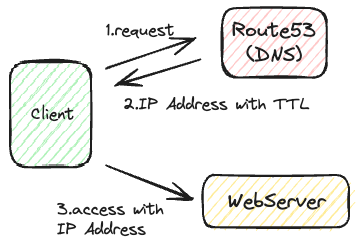
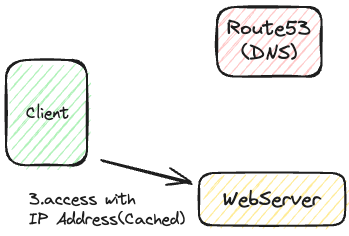

# Route53

## 概要

高可用性、スケーラブルなフルマネージドのDNS。

- DNSを完全に制御可能
- ドメインレジストラー
- Route53リソース内のヘルスチェックが可能
- AWS唯一の100%可用性のサービス

ちなみに53は従来のDNS用ポート番号。


## レコード

- 特定ドメインにおけるトラフィックのルーティン方法を定義
- 以下のような値を定義
  - ドメイン/サブドメイン名
  - レコードタイプ（Aレコード、AAAAレコードなど）
  - 値（IPアドレスなど）
  - ルーティングポリシー
    - クエリに応答する方法
  - TTL
    - DNSリゾルバーのキャッシュ生存時間
- レコードはDNSリゾルバーにキャッシュされる
- サポートするレコードは以下
  - Basic
    - A
    - AAAA
    - CNAME
    - NS
  - Advanced
    - CAA
    - DS
    - MX
    - NAPTR
    - PTR
    - SOA
    - TXT
    - SPF
    - SRV

## レコードタイプ

### Aレコード

ホスト名とIPv4アドレスをマッピングする。


ちなみにターミナルから以下のコマンドで確認できる。

```shell-session
nslookup [ドメイン]
```

```shell-session
dig [ドメイン]
```

### AAAAレコード

ホスト名とIPv6アドレスをマッピングする。

### CNAMEレコード

ホスト名を別のホスト名にマッピングする。  
他ドメインからAWSリソースへトラフィックするようにマッピングする。

- ターゲットとなるホスト名はAレコードやAAAAレコードとなる可能性がある。
- DNS名前空間、ZoneApex最上位ノードでは作成できない。
  - 例えば「example.com」のCNAMEレコードを作成することはできないが、「www.example.com」のCNAMEレコードは作成できる

#### NSレコード

ホストゾーンのネームサーバ。

- ドメインにルーティングされる方法を制御可能

## ホストゾーン

レコードのコンテナとして機能し、ドメインにおけるトラフィックのルーティング方法を全て管理する。

### パブリックホストゾーン

パブリックなドメイン名（インターネット）のトラフィックのルーティング方法を全て管理する。

- 「xxxx.mypublicdomain.com」みたいなイメージ

### プライベートホストゾーン

プライベートなドメイン名（自身の仮想プライベートクラウド、VPC内）のトラフィックのルーティング方法を全て管理する。
企業内のみでアクセスできるネットワーク等で使用する。

- 「xxxx.mycompany.internal」みたいなイメージ

## 料金

ホストゾーンごとに支払う。

## TTL

「Time To Live」のこと。
クライアントは様々なエンドポイントにアクセスする際に基本的にはドメインでアクセスする。  
その場合、以下のようにアクセスが行われている。

1. クライアントはDNS（Route53）に一度アクセスを行い、ドメインのIPアドレスを取得する
2. クライアントは取得したIPアドレスに対してアクセスを行う

DNSからドメインのIPアドレスを取得する際にTTLも同時に取得する。  
TTLの時間分はクライアント側にIPアドレスのキャッシュが行われる。  
その期間内は同ドメインに対して再度アクセスした際にキャッシュしたIPアドレスに直接アクセスする。（DNSへの問い合わせは行わない）  

TTLがない、もしくはTTLの期限切れの場合  


TTLの期限内の場合  


Aliasレコードを除いて全てのレコードでTTLは必須となる。

### TTLを高めに設定した場合

TTLを高め（例えば24時間）に設定した場合はクライアントにキャッシュされる時間も長くなるため  
Route53に対するトラフィックは減少する（料金が下がる）  
ただし簡単にレコードの内容を更新することはできなくなる。

### TTLを低めに設定した場合

TTLを低め（例えば60秒）に設定した場合はクライアントにキャッシュされる時間も短くなるため  
Route53に対するトラフィックは増加する（料金が上がる）  
簡単にレコードの内容を更新することができる。

